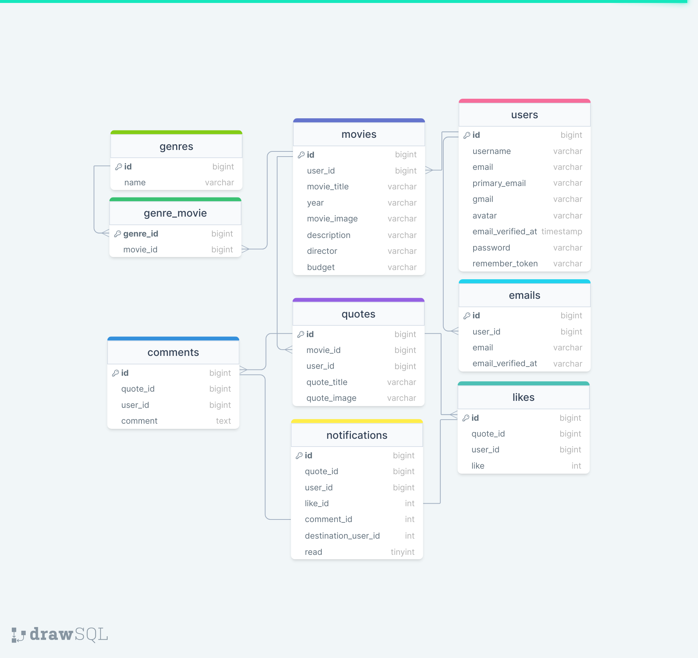

<div>
  <h1 style="position:relative; top: 6px" >Movie Quotes Api</h1>
</div>


The Movie quotes Api designed to serve an SPA via laravel Sanctum. 
Using this api Users can upload movies and quotes, share them to others, and communicate with comments and likes.
<br>

The api designed with Laravel enables user to register, login with multiple emails and manage user account, upload avatar, change passwords, emails etc. User can also authorize via gmail.
<br> 

The api includes CRUDs of movies, quotes, emails, users etc.
<br>

Movie Quotes Api implements realtime communication with frontend using pusher api, so that users see notifications live. 
<br>
#
### Table of Contents
* [Prerequisites](#prerequisites)
* [Tech Stack](#tech-stack)
* [Getting Started](#getting-started)
* [Migrations](#migration)
* [Seed genres](#seed-genres-table)
* [Development](#development)
* [Project Structure](#project-structure)
* [Database Design Diagram](#database-design-diagram)

#
### Prerequisites

*  *PHP@8.02 and up to 8.2*
*  *MYSQL@8 and up*
*  *npm@6 and up*
*  *composer@2 and up*


#
### Tech Stack

*  [Laravel@9.x](https://laravel.com/docs/6.x) - back-end framework
*  [Spatie@6.x](https://laravel.com/docs/6.x) - Spatie translatable
*  [Pusher@7.x](https://laravel.com/docs/6.x) - Api for webSockets


#
### Getting Started
1\. First of all you need to clone movie quotes api repository from github:
```sh
git clone https://github.com/RedberryInternship/lomidze-coronatime.git
```

2\. Next step requires you to run *composer install* in order to install all the dependencies.
```sh
composer install
```

3\. after you have installed all the PHP dependencies, it's time to install all the JS dependencies:
```sh
npm install
```

and also:
```sh
npm run dev
```
in order to build your tailwind resources.

4\. Now we need to set our env file. Go to the root of your project and execute this command.
```sh
cp .env.example .env
```
And now you should provide **.env** file all the necessary environment variables:

#
**MYSQL:**
>DB_CONNECTION=mysql

>DB_HOST=127.0.0.1

>DB_PORT=3306

>DB_DATABASE=*****

>DB_USERNAME=*****

>DB_PASSWORD=*****

##### Now, you should be good to go!


#
### Generate App key
if you've completed getting started section, generate app key:
```sh
php artisan key:generate
```

#
### Migration
then migrating database is fairly simple process, just execute:
```sh
php artisan migrate
```

#
### Publish assets
To create the symbolic link to make assets accessible from the web
```sh
php artisan storage:link
```

#
### Development

You can run Laravel's built-in development server by executing:

```sh
  php artisan serve
```
and then refer to the next segment.

#
### Seed genres table

With this command, you seed database genres table to enable user to add a new movie later.

```sh
  php artisan db:seed --class=GenreSeeder
```

#
### Project Structure

```bash
├─── app
│   ├─── Console
│   │   ├─── commands
│   ├─── Exceptions
│   ├─── Faker
│   ├─── Helpers
│   ├─── Http
│   │   ├─── Controllers
│   │   ├─── Middleware
│   │   ├─── Requests
│   ├─── Models
│   ├─── Providers
├─── bootstrap
├─── config
├─── database
├─── lang
├─── public
├─── readme
├─── resources
├─── routes
├─── storage
- .env
- artisan
- composer.json
- package.json
- phpunit.xml
```

#
### Database Design Diagram
[drawSQL link](https://drawsql.app/teams/geo-3/diagrams/epi-movie-quotes)

<a href="https://drawsql.app/teams/geo-3/diagrams/epi-movie-quotes" target="blank_">
  
<a/>
